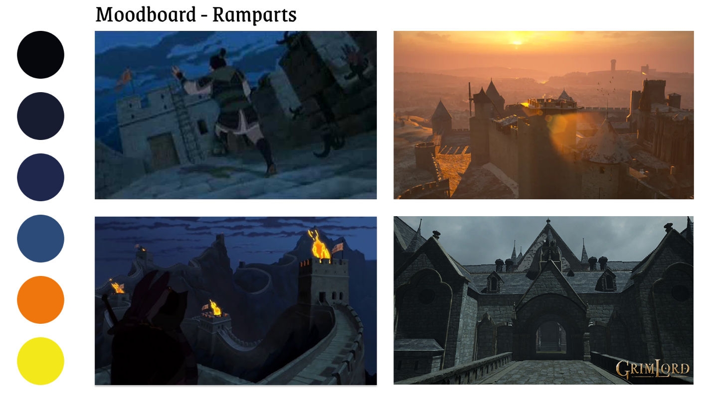

# Ben_Maiz-Rada_Lysenko_Iryna_TP3

-----------------------------------------------------------------------------------------------------------
Le joueur incarne un personnage qui se réveille dans un lieu inconnu et confiné, sans aucun souvenir clair. L’environnement est inquiétant et semble évoluer entre réalité et hallucination.

Pour progresser, le joueur utilise des potions mystérieuses qui lui permettent de basculer dans une version alternative du monde : un univers déformé, violent et cauchemardesque. Ces transitions révèlent des indices essentiels à sa survie.

L’objectif principal est de s’échapper de cet espace tout en découvrant la vérité derrière un événement tragique survenu auparavant, et retrouver une forme de paix.

# Intention du jeu

Le jeu vise à :

Explorer les thèmes de la perception altérée, de la folie et de la culpabilité
Créer une tension psychologique constante via des changements de réalité
Encourager l’observation et la réflexion à travers des puzzles interdimensionnels
Offrir une narration implicite où le joueur reconstruit les événements passés

## Gameplay & Mécaniques
Transitions entre mondes
Passage entre réalité et hallucination via des potions
Effets visuels : flou, distorsion, changements d’ambiance
Modifications dynamiques de l’environnement
Système de potions
Collecte de 8 potions au total
Activation par collision avec le joueur
Effet temporaire (téléportation vers une autre dimension)
Énigmes
Résolution de puzzles en exploitant les deux dimensions
Recherche d’indices dans le monde alternatif pour influencer la réalité
Systèmes de codes, leviers, mécanismes verrouillés
 ## Système de tension
Si le joueur ne consomme pas de potion pendant un certain temps :
Apparition progressive de créatures
Altération des animations et de l’environnement (ex : ciel, ambiance sonore)
Intensification de l’instabilité mentale du personnage
 ## Structure du jeu
Exploration du château et de ses extérieurs
3 chemins narratifs possibles
Progression non linéaire avec zones à revisiter
Plusieurs transitions de scènes fréquentes
Direction artistique
## Style visuel
Inspiré de Fran Bow (horreur psychologique, esthétique dessinée)
Univers médiéval sombre
## Palette de couleurs
Tons dominants :
Bleu sombre
Rouge profond
Vert désaturé
Contrastes forts entre réalité et hallucination
## Concepts narratifs
Concept A — Le Bouffon

Un bouffon dépressif devenu instable consomme des potions et sombre dans la folie. Il tente de s’échapper des geôles du roi.

La dernière potion se trouve dans le château
Rencontre finale avec un démon (boss)
Révélation : le joueur tue le roi en pensant combattre une illusion

Concept B — Le Garde
Un garde de nuit insomniaque surveille les portes du château. Affecté par des potions magiques, il commence à halluciner.
Mécanique de gestion de l’éveil (rester conscient)
Collecte de potions avec effets temporisés
Dégradation mentale progressive

### Éléments clés
8 potions à collecter
Plusieurs énigmes et systèmes de codes
Un combat de boss (selon le concept choisi)
Évolution dynamique de l’environnement
Traversée d’une planche en bois (équilibre)
Interaction à distance (ex : activer un levier)

### Production
Modélisation 3D des personnages et environnements
Organisation du travail avec livrables et échéances par membre
Présentation des éléments individuels selon un calendrier défini

- **asset kit:** https://kenney.nl/assets/retro-fantasy-kit
- **Jeu pour s'inspirer:** https://youtu.be/7ROzsoNWZHI?si=0Kub8O5o-up0kmY2

# MoodBoard

# Sons - effets -musique

Sound effects :
https://pixabay.com/sound-effects/film-special-effects-085594-potion-35983/
https://pixabay.com/sound-effects/horror-nightmare-68768/
https://pixabay.com/users/freesound_community-46691455/
https://pixabay.com/sound-effects/horror-noisy-nightmare-drone-74472/
https://pixabay.com/sound-effects/film-special-effects-slow-cinematic-clock-ticking-tension-2-323078/
https://pixabay.com/sound-effects/film-special-effects-clock-strike-64020/
https://pixabay.com/sound-effects/film-special-effects-medieval-funeral-159886/
https://pixabay.com/sound-effects/nature-night-ambience-29548/
https://pixabay.com/sound-effects/film-special-effects-footsteps-walking-boots-parquet-1-420135/
https://pixabay.com/sound-effects/film-special-effects-foley-footsteps-laminate-001-77031/
https://pixabay.com/sound-effects/horror-whisper-voices-1-193087/
https://pixabay.com/sound-effects/horror-demon-chant-latin-14489/
https://pixabay.com/sound-effects/film-special-effects-clock-strike-64020/
https://pixabay.com/sound-effects/film-special-effects-%c3%a9p%c3%a9e-342933/
https://pixabay.com/music/cartoons-hava-nagila-445173/

# Schéma de Jeu

