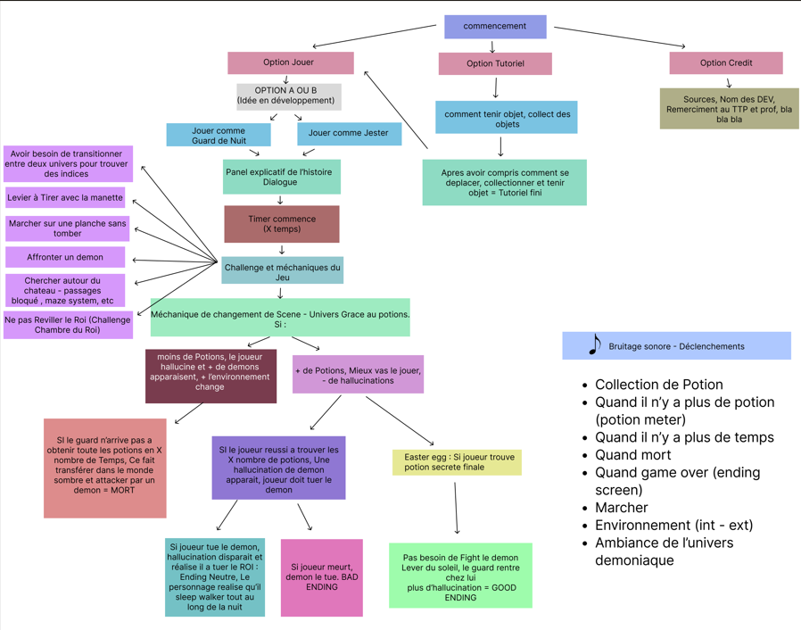

# Ben_Maiz-Rada_Lysenko_Iryna_TP3
meow

-----------------------------------------------------------------------------------------------------------
- Person wakes up, finds themselves in place (undefined), locked place needs to escape something creepy. Uses potion with mysterious liquid to teleport into fever dream creepy and bloody version of location.

- Objectif, escape the area and find peace of before disaster.

- Mechanics : Scene transitioning ( flou, hallucination ), potion object contact collision shape w player. Puzzle (chercher un indice dans l'autre monde pour ouvrir ou ressoudre une enigma situer au temps reel.

- Style de jeu : Fran Bow

- Aesthetic : Medieval

- Palette de couleur : Blues, reds, greens Dark.

- Draw a map of the game 

-  Idea A:Crazy Depressed Jester drinks potions, goes insane and try to escape de dungeon of the king.

- Idea B: Night guard insomniac guarding the castle gates, starts to see things , second effects of the potion making him go crazy. (magic) Try's to stay awake. Collection of potions (TP2 mechanism with timer). 

Animation change by time if player did not collect a potion for x amount of time. Animation plays. The more there is no potion the more creatures appear. Skydome animation change. A lot of scene transitions.

A couple of riddles. Codes...etc.

3 different paths

8 potions to collect.

Concept A : 8 potions, last one is in the castle, once u find it u find a demon too. (boss fight, mental health goes good, you slice it and then blink out of the illusion to find out you actually killed the king.

Walk around the castle, outside .  

Challenge VR : cross A woden plank. Pull a lever using remote.

Rester sur place pour le jeu ou Bouger en vrai vie.

Model 3d a modeliser chaque personne + due date of when each person has to present their item.

- **asset kit:** https://kenney.nl/assets/retro-fantasy-kit
- **Jeu pour s'inspirer:** https://youtu.be/7ROzsoNWZHI?si=0Kub8O5o-up0kmY2

# SOUNDS

Sound effects :
https://pixabay.com/sound-effects/film-special-effects-085594-potion-35983/
https://pixabay.com/sound-effects/horror-nightmare-68768/
https://pixabay.com/users/freesound_community-46691455/
https://pixabay.com/sound-effects/horror-noisy-nightmare-drone-74472/
https://pixabay.com/sound-effects/film-special-effects-slow-cinematic-clock-ticking-tension-2-323078/
https://pixabay.com/sound-effects/film-special-effects-clock-strike-64020/
https://pixabay.com/sound-effects/film-special-effects-medieval-funeral-159886/
https://pixabay.com/sound-effects/nature-night-ambience-29548/
https://pixabay.com/sound-effects/film-special-effects-footsteps-walking-boots-parquet-1-420135/
https://pixabay.com/sound-effects/film-special-effects-foley-footsteps-laminate-001-77031/
https://pixabay.com/sound-effects/horror-whisper-voices-1-193087/
https://pixabay.com/sound-effects/horror-demon-chant-latin-14489/
https://pixabay.com/sound-effects/film-special-effects-clock-strike-64020/
https://pixabay.com/sound-effects/film-special-effects-%c3%a9p%c3%a9e-342933/
https://pixabay.com/music/cartoons-hava-nagila-445173/

# Schéma de Jew

